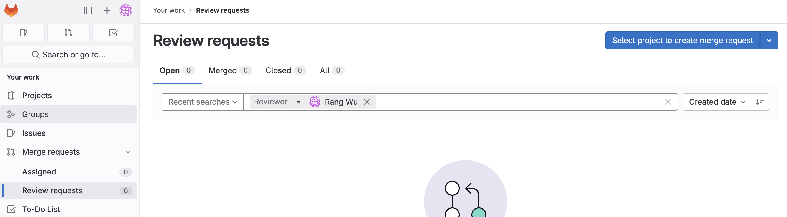
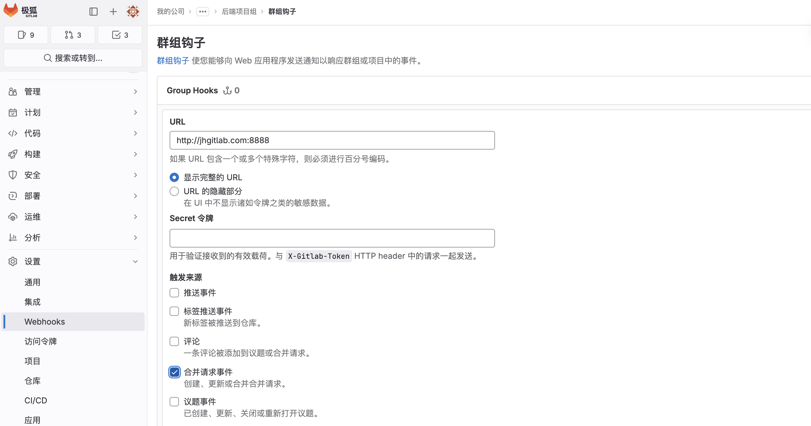
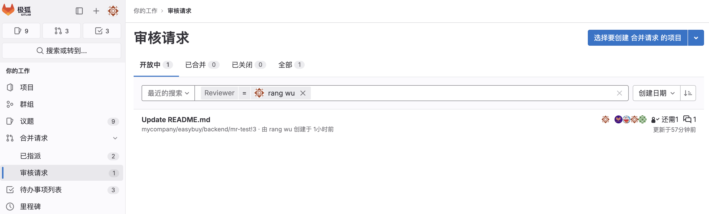

### 1. 功能概述
通过Webhook自动将GitLab合并请求批准人设置为合并请求审核人

### 2. 项目背景
GitLab Premium（专业版）提供了[合并请求批准规则Approval Rules](https://docs.gitlab.com/ee/user/project/merge_requests/approvals/rules.html)功能，可以自定义合并请求审批规则，以确保每个合并请求必须经过流程化的审批才能合并。

此外GitLab Premium（专业版）也提供了[代码所有者Code Owners](https://docs.gitlab.com/ee/user/project/codeowners/)功能，可以给不同的文件夹、文件类型设置负责人，当文件发生变化时，自动将对应的代码负责人拉入合并请求审批过程中，防止在协同开发过程中未经授权的变更带来的冲突和风险。

这两项功能可以实现强制且受管控的Code Review过程，对于企业提高代码质量起到了重要作用。然而开启这两项功能后，默认情况下批准人Approval和负责人CodeOwners都无法收到对应合并请求的邮件通知，也无法在GitLab个人页面的合并请求任务中看到对应的信息：


这是因为在GitLab的理念中，批准人Approval和负责人CodeOwners都只是审核人Reviewers的候选人，在创建合并请求时，创建人应该根据本次合并请求涉及的内容在批准人Approval和负责人CodeOwners中选择部分人员作为本次合并请求的审核人Reviewers，而不是通知到所有人，这会给其他人带来困扰。这个理念也许有一定的道理，但也确实有不少用户提出相关诉求，希望默认将批准人Approval和负责人CodeOwners作为审核人Reviewers并邮件通知这些人。这个争论持续了4年之久，至今还没有解决，你依然可以在该[Issue](https://gitlab.com/gitlab-org/gitlab/-/issues/12855)中了解它的来龙去脉，或发表你的评论。

为了解决该问题，该程序通过监听GitLab Webhook，并调用GitLab API，自动将合并请求批准人Approval和负责人CodeOwners设置为审核人Reviewers。

### 3. 使用说明
#### 3.1 编译
1. 依赖
   - golang >= 1.16
2. 配置
   - 修改`main.go`中的变量
     - `GITLAB_URL`: GitLab地址，如https://gitlab.com
     - `GITLAB_ACCESS_TOKEN`: GitLab访问令牌，可参考设置 https://docs.gitlab.com/ee/user/profile/personal_access_tokens.html
     - `GITLAB_WEBHOOK_SECRET`: 创建Webhook时填写的Secret，用于一致性校验，此处可以不填
     - `PORT`: 服务端口，默认8888
3. 编译
   ``` shell
    go mod init gitlab-approvals-to-reviewers
    go mod tidy
    go build .
   ``` 
#### 3.2 使用
1. 将编译好的程序拷贝到服务器的指定路径，如`/home/ubuntu/gitlab-approvals-to-reviewers`
2. 启动服务`nohup /home/ubuntu/gitlab-approvals-to-reviewers &`
3. 在GitLab项目或群组中，配置Webhook，设置`URL`为部署该程序的服务器IP/域名和端口，勾选`合并请求事件`，如果`URL`为`https`协议，则勾选`启用SSL验证`，否则取消勾选，创建完成后测试Webhook，选择`合并请求事件`，验证是否返回204：
   
4. 在配置了Webhook的GitLab项目中，确保已创建批准人Approval和负责人CodeOwners，然后创建/编辑合并请求或给已存在的合并请求随机分配审核人，用于触发Webhook，随后该程序会自动将批准人Approval和负责人CodeOwners设置为审核人Reviewers，可刷新查看并验证，他们都会收到相关的通知邮件，并在个人页面的合并请求中看到对应的任务：
   

#### 3.3 日志
1. 日志默认存储在该程序目录下`logs`文件夹中，其中`info.log`是INFO级别的日志，`error.log`是ERROR级别的日志
2. 日志按1MB分文件，默认保留30天

### 4. 限制
1. 该程序强制将批准人Approval和负责人CodeOwners设置为审核人Reviewers，如果合并请求已经设置了其他审核人Reviewers，则会被强制覆盖
2. 该程序为非GitLab官方支持工具，仅供学习参考，产生的任何问题不在GitLab服务范围内
3. 该程序需要为每个GitLab项目或群组设置Webhook，可以通过以下方式快速实现：
   - [GitLab API](https://docs.gitlab.com/ee/api/projects.html#add-project-hook)
   - [GitLab Rake tasks](https://docs.gitlab.com/ee/raketasks/web_hooks.html)